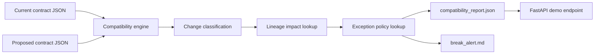

# cdc-data-contract-hub

A local-first CDC contract workflow that compares schema versions, classifies compatibility risk, attaches downstream lineage context, and emits break alerts before a source change reaches consumers.

## Problem

CDC pipelines fail quietly when schema changes are treated as "someone else's problem." Real data platform teams need a repeatable way to compare source contracts, decide whether a change is safe, and understand which downstream assets will break before the change is promoted. This repo focuses on that pre-break workflow.

## Architecture

The V1 implementation is intentionally compact and transparent:

- versioned JSON contracts simulate source schema evolution
- a compatibility engine compares the current and proposed contracts field by field
- lineage metadata maps changed fields to downstream consumers
- approved temporary exceptions can downgrade a finding while preserving the audit trail
- a reporting layer emits both a machine-readable compatibility report and a Markdown break alert
- a FastAPI endpoint serves the same demo report that the CLI produces



## Contract Example

The repo proves contract governance by comparing a current schema against a proposed one before downstream consumers are surprised.

Current contract example:

```json
{
  "name": "order_events_v1",
  "fields": [
    { "name": "order_id", "type": "string", "nullable": false },
    { "name": "customer_tier", "type": "string", "nullable": false },
    { "name": "order_total", "type": "double", "nullable": false }
  ]
}
```

Proposed breaking example:

```json
{
  "name": "order_events_v2_breaking",
  "fields": [
    { "name": "order_id", "type": "string", "nullable": false },
    { "name": "order_total", "type": "int", "nullable": false }
  ]
}
```

That change is breaking because a required field disappears and `order_total` narrows from `double` to `int`.

## Tradeoffs

This V1 makes three deliberate tradeoffs:

1. Contracts are modeled as local JSON files instead of a full schema registry so the compatibility logic stays runnable without external infrastructure.
2. The repo simulates a few representative change patterns instead of a huge catalog because the point is to prove contract discipline and blast-radius thinking first.
3. The lineage model is static metadata for V1 rather than a live catalog integration so the downstream impact stays explicit and inspectable.

## Repo Layout

```text
cdc-data-contract-hub/
├── app/
│   ├── cli.py
│   ├── contracts.py
│   ├── main.py
│   ├── models.py
│   └── reporting.py
├── contracts/
├── generated/
├── lineage/
└── tests/
```

## Run Steps

### Install Dependencies

```bash
git clone https://github.com/srn91/cdc-data-contract-hub.git
cd cdc-data-contract-hub
python3 -m pip install -r requirements.txt
```

### Generate the Demo Compatibility Report

```bash
make report
```

That writes:

- `generated/compatibility_report.json`
- `generated/break_alert.md`

The demo report now also loads:

- `exceptions/order_events_v2_breaking_exceptions.json`

### Start the API

```bash
make serve
```

Useful endpoints:

- `http://127.0.0.1:8001/health`
- `http://127.0.0.1:8001/demo/report`

### Run the Full Quality Gate

```bash
make verify
```

## Hosted Deployment

- Live URL: [cdc-data-contract-hub.onrender.com](https://cdc-data-contract-hub.onrender.com)
- Open this first: [`/demo/report`](https://cdc-data-contract-hub.onrender.com/demo/report)
- Browser smoke result: the live report rendered immediately in-browser and returned the breaking-change classification plus impacted downstream consumers.
- Render config: branch `main`, auto-deploy on commit, runtime `python`, build command `pip install -r requirements.txt`, start command `uvicorn app.main:app --host 0.0.0.0 --port $PORT`, health check path `/health`

## Validation

The V1 repo currently verifies:

- additive nullable fields are treated as compatible
- removing required fields is treated as breaking
- incompatible type changes are surfaced explicitly
- downstream lineage impact is attached to each breaking change
- CLI and API return the same report for the demo scenario

Current demo report snapshot:

- current contract: `order_events_v1`
- proposed contract: `order_events_v2_breaking`
- overall status: `breaking`
- breaking reasons: removal of `customer_tier`, narrowing `order_total` from `double` to `int`
- approved exception: `exc-order-total-type-narrowing` temporarily downgrades the `order_total` narrowing from blocking to warning with ticket and expiry metadata
- impacted consumers: `daily_revenue_dashboard`, `fraud_feature_store`, `customer_health_mart`

Local quality gates:

- `make lint`
- `make test`
- `make report`
- `make verify`

## Current Capabilities

The V1 repo demonstrates:

- versioned CDC contract comparison
- field-level compatibility classification
- lineage-aware blast-radius reporting
- exception-aware policy handling with auditable temporary waivers
- machine-readable and reviewer-facing alert artifacts
- FastAPI surface for the demo compatibility report

## Future Expansion

Possible follow-on work outside the current shipped scope:

1. add forward- and backward-compatibility modes by consumer type
2. ingest Avro or Protobuf schemas instead of only JSON contract specs
3. integrate with a registry or migration approval workflow
4. add historical contract diff storage and trend reporting
5. surface exception-expiry alerts before waivers lapse
